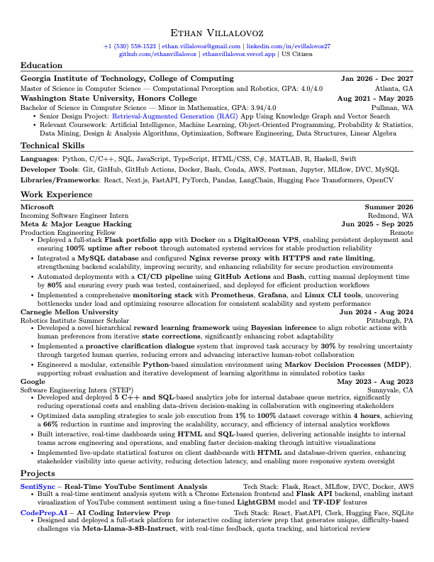

# 💼 Ethan's LaTeX Resume Template


---

## 🚀 Introduction

A clean, ATS-friendly, and professional LaTeX resume template designed for clarity, impact, and easy customization. Perfect for students, early-career professionals, and anyone who wants a modern, one-page resume.

---

## 📋 Description

This template emphasizes:
- **Minimalist, one-page layout** for maximum readability
- **Bold tech stacks** and modular bullet points for easy scanning
- **Machine-readable PDF output** for ATS compatibility
- **Easy customization** with clear LaTeX commands

---

## 🖼️ Visuals



---

## 📦 Prerequisites

- **LaTeX distribution**: [TeX Live](https://www.tug.org/texlive/) (Linux/Windows) or [MacTeX](https://tug.org/mactex/) (macOS)
- (Optional) [Overleaf](https://overleaf.com/) account for online editing

---

## 🛠️ Technologies Used

- **LaTeX** (core typesetting)
- **Packages**: `fullpage`, `titlesec`, `marvosym`, `fontawesome5`, `tabularx`, `multicol`, `hyperref`, `fancyhdr`, `enumitem`, `geometry`
- **PDF output**: ATS-friendly, machine-readable

---

## 📖 About the Template

Curious about the design philosophy, technical choices, and why this template works so well for technical roles?  

See [docs/ABOUT.md](docs/ABOUT.md) for a deep dive into the reasoning behind the layout, ATS compatibility, and customization features.

---

## ⚡ QuickStart Guide

1. **Clone the repo:**
   ```bash
   git clone https://github.com/ethanvillalovoz/latex-resume-template.git
   cd latex-resume-template
   ```

2. **Build the resume locally:**
   ```bash
   cd src
   pdflatex resume.tex
   ```
   The output `resume.pdf` will be generated in the `src/` directory.

3. **Or use Overleaf:**
   - Upload `src/resume.tex` to [Overleaf](https://overleaf.com/)
   - Edit and download your PDF

---

## 🔬 Advanced Usage

- **Customize sections**: Edit or add sections in `src/resume.tex` as needed.
- **Add new commands**: Define your own LaTeX commands for repeated patterns.
- **Change fonts or colors**: Modify the preamble to adjust style.
- **ATS optimization**: Avoid images or graphics in the main content.

---

## ⚙️ Configuration

- **Contact Info**: Update your name, email, phone, and links at the top of `src/resume.tex`.
- **Section Content**: Use `\resumeItem{}` for bullet points and `\resumeSubheading{}` for roles/education.
- **Bold Technologies**: Use `\textbf{}` for highlighting tools and languages.

---

## 🧪 Automated Test

To verify your LaTeX installation and template build:
```bash
cd src
pdflatex resume.tex
# Check for resume.pdf output and no errors in the log
```

---

## 🗂️ Folder Structure

```
latex-resume-template/
├── .github/                 # GitHub templates and workflows
│   ├── ISSUE_TEMPLATE/
│   └── PULL_REQUEST_TEMPLATE.md
├── docs/                    # Documentation and preview
│   ├── ABOUT.md
│   ├── preview.png
│   └── resume.pdf           # Compiled sample (not versioned)
├── src/                     # LaTeX source files
│   └── resume.tex
├── .gitignore
├── CONTRIBUTING.md
├── LICENSE
└── README.md
```

---

## 🛣️ Roadmap

- [ ] Add more resume section templates (e.g., Publications, Awards)
- [ ] Provide alternate color schemes
- [ ] Add CI for automated PDF builds
- [ ] Expand documentation (FAQ, troubleshooting)

---

## 🤝 Contribution

Contributions are welcome! To contribute:
- Fork the repo and create a new branch
- Make your changes (improve template, docs, or add features)
- Open a pull request with a clear description

For more details, see [CONTRIBUTING.md](CONTRIBUTING.md).

---

## 📜 License

MIT License — free to use, modify, and share. Attribution appreciated, but not required.

---

## 💬 Contact

If this template helps you land an interview or job, I’d love to hear about it!  
Feel free to reach out: ethan.villalovoz@gmail.com
