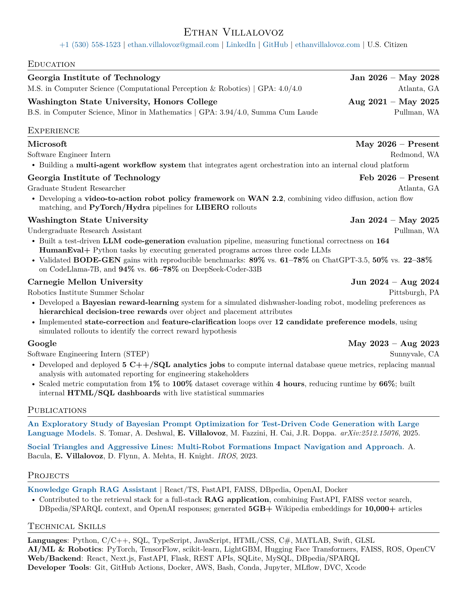
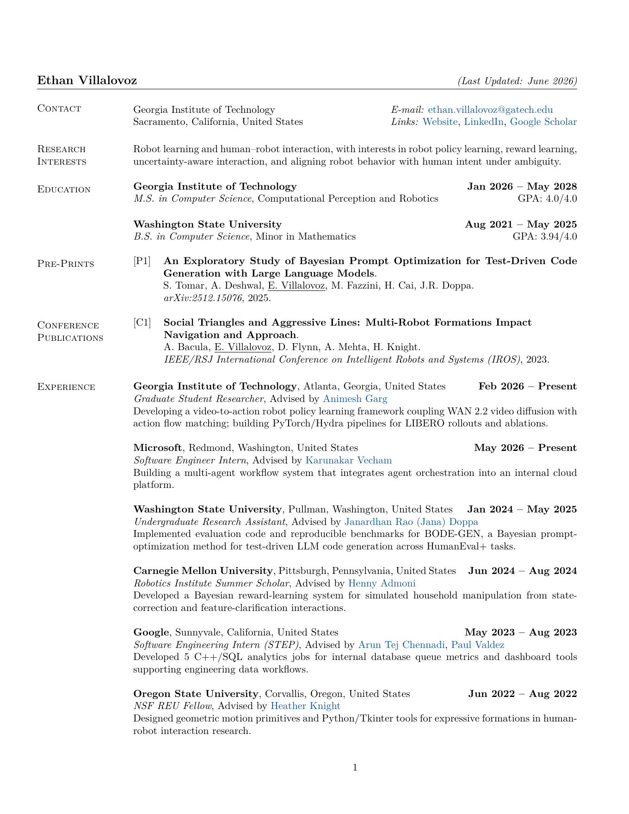

# LaTeX Resume + Academic CV

[](https://github.com/ethanvillalovoz/latex-resume-template/actions/workflows/ci.yml)
[](https://www.overleaf.com/)
[](LICENSE)

Two restrained, text-extraction-tested LaTeX templates: a one-page technical resume and a research-oriented academic CV.

| Technical resume | Academic CV |
| --- | --- |
| [](docs/resume.pdf) | [](docs/cv.pdf) |
| [Open example PDF](docs/resume.pdf) | [Open example PDF](docs/cv.pdf) |

The examples use real software engineering and research content; the starter files contain neutral placeholders. Both tracks compile with XeLaTeX, preserve selectable text, include searchable PDF metadata, and use visible but conservative links.

## Choose A Starting Point

| Goal | Start here | Example |
| --- | --- | --- |
| Technical recruiting | [`src/starter-resume.tex`](src/starter-resume.tex) | [`src/resume.tex`](src/resume.tex) |
| Research, fellowships, or graduate applications | [`src/cv/starter-cv.tex`](src/cv/starter-cv.tex) | [`src/cv/cv.tex`](src/cv/cv.tex) |

The resume is intentionally selective and one page. The CV gives publications, advisors, teaching, awards, and service room to breathe.

## Use In Overleaf

1. Download this repository as a ZIP.
2. Create an Overleaf project with **New Project > Upload Project**.
3. For a resume, set `src/starter-resume.tex` as the main document.
4. For a CV, set `src/cv/starter-cv.tex` as the main document and keep `src/cv/res.cls` beside it.
5. Select XeLaTeX and compile.

The templates are self-contained and do not require custom fonts.

## Build Locally

Install TeX Live with `latexmk` and XeLaTeX, then:

```sh
git clone https://github.com/ethanvillalovoz/latex-resume-template.git
cd latex-resume-template
python3 -m pip install -r requirements-dev.txt
make check
```

`make check` compiles all four entry points and verifies:

- expected page counts
- US Letter page geometry
- title and author metadata
- non-empty, readable text extraction on every page
- document-specific section markers
- absence of Unicode replacement characters

Regenerate the committed example PDFs and first-page previews after a visual change:

```sh
make previews
```

## Customize Deliberately

- Replace contact details and PDF metadata before changing content.
- Keep bullets evidence-led: what you built, how it worked, and what changed.
- Remove weak sections before shrinking type or margins.
- Use `\resumeSubheading`, `\resumeProjectHeading`, and `\resumeItem` to preserve alignment.
- Keep your own name visually distinct in publication author lists.
- Re-run text extraction checks after adding uncommon symbols or fonts.

Read [Why these layouts work](docs/ABOUT.md) for the design rationale and [FAQ](docs/FAQ.md) for compiler, spacing, color, and ATS guidance.

## Repository Layout

```text
.
├── src/
│   ├── resume.tex                 # Technical resume example
│   ├── starter-resume.tex         # Technical resume starter
│   └── cv/
│       ├── cv.tex                 # Academic CV example
│       ├── starter-cv.tex         # Academic CV starter
│       └── res.cls                # Vendored CV class with original notice
├── scripts/verify_pdfs.py         # Metadata, geometry, and extraction gate
├── docs/                          # Rendered examples and guidance
├── Makefile                       # Build, verify, preview, and clean targets
└── .github/workflows/ci.yml       # Reproducible TeX Live 2026 build
```

## What ATS-Friendly Means Here

These PDFs use selectable text, semantic section names, ordinary fonts, and tested extraction. That removes several common parser failure modes, but no template can guarantee behavior across every applicant tracking system. Always inspect the text extracted from your final customized PDF.

## Privacy

The example files intentionally contain the author's public professional information. Replace all names, email addresses, phone numbers, URLs, locations, and PDF metadata before publishing your own copy. Sanitize customized documents before attaching them to an issue.

## Provenance

The technical resume is based on Jake's Resume. The academic CV includes the classic `res.cls`. See [Third-Party Notices](THIRD_PARTY_NOTICES.md) for attribution and retained terms.

## License

Original contributions are released under the [MIT License](LICENSE). Third-party components retain their original notices.
