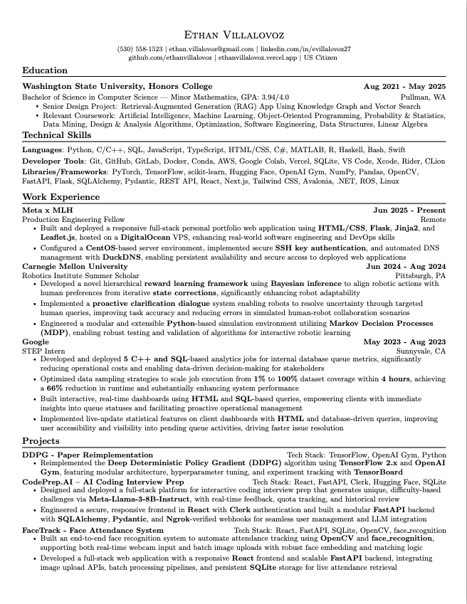

# 💼 Ethan's LaTeX Resume Template


---

## 🚀 Introduction

A clean, ATS-friendly, and professional LaTeX resume template designed for clarity, impact, and easy customization.  

Perfect for students, early-career professionals, and anyone who wants a modern, one-page resume — all editable directly on **Overleaf**.

---

## 📋 Description

This template emphasizes:
- **Minimalist, one-page layout** for maximum readability
- **Bold tech stacks** and modular bullet points for easy scanning
- **Machine-readable PDF output** for ATS compatibility
- **Fully editable on Overleaf** — no local setup required

---

## 🖼️ Visuals



---

## 🛠️ Technologies Used

- **LaTeX** (core typesetting)
- **Packages**: `fullpage`, `titlesec`, `marvosym`, `fontawesome5`, `tabularx`, `multicol`, `hyperref`, `fancyhdr`, `enumitem`, `geometry`
- **PDF output**: ATS-friendly, machine-readable
- **Platform**: Overleaf for online editing and compilation

---

## 📖 About the Template

Curious about the design philosophy, technical choices, and why this template works so well for technical roles?  

See [docs/ABOUT.md](docs/ABOUT.md) for a deep dive into the reasoning behind the layout, ATS compatibility, and customization features.

See [docs/COMPANIES.md](docs/COMPANIES.md) for a list of companies where this resume has earned me interview opportunities for both internships and full-time roles.

---

## ⚡ QuickStart Guide (Overleaf)

1. **Download or clone the repository:**
   ```bash
   git clone https://github.com/ethanvillalovoz/latex-resume-template.git
   ```
   or simply click **“Download ZIP”** from GitHub.

2. **Upload to Overleaf:**
   - Go to [Overleaf](https://overleaf.com/)
   - Create a **New Project → Upload Project**
   - Upload the entire `src/` folder (or just `src/resume.tex` if you prefer)

3. **Edit and compile:**
   - Modify your details directly in `resume.tex`
   - Click **Recompile** to generate your PDF
   - Download the final `resume.pdf`

---

## 🔧 Customization

- **Contact Info**: Update your name, email, phone, and links at the top of `resume.tex`
- **Section Content**: Use `\resumeItem{}` for bullet points and `\resumeSubheading{}` for roles or education
- **Bold Technologies**: Use `\textbf{}` to highlight programming languages or tools
- **Style Adjustments**: Modify the preamble to change fonts, spacing, or colors

---

## 🗂️ Folder Structure

```
latex-resume-template/
├── .github/                 # GitHub templates and workflows
│   ├── ISSUE_TEMPLATE/
│   ├── workflows/           # CI/CD workflows for automated PDF build & deploy
│   └── PULL_REQUEST_TEMPLATE.md
├── docs/                    # Documentation and preview
│   ├── ABOUT.md
│   ├── preview.png
│   └── resume.pdf           # Compiled sample (not versioned)
├── src/                     # LaTeX source files
│   └── resume.tex
├── .gitignore
├── CONTRIBUTING.md
├── LICENSE
└── README.md
```

---

## 🛣️ Roadmap

- [x] Overleaf-only version for easier use  
- [ ] Add more resume section templates (e.g., Publications, Awards)  
- [ ] Provide alternate color schemes  
- [ ] Expand documentation (FAQ, troubleshooting)

---

## 🤝 Contribution

Contributions are welcome!  
To contribute:
1. Fork the repo and create a new branch  
2. Make your improvements (e.g., design tweaks, doc edits)  
3. Open a pull request with a clear description  

For more details, see [CONTRIBUTING.md](CONTRIBUTING.md).

---

## 📜 License

MIT License — free to use, modify, and share. Attribution appreciated, but not required.

---

## 💬 Contact

If this template helps you land an interview or job, I’d love to hear about it!  

Reach out at **ethan.villalovoz@gmail.com**
